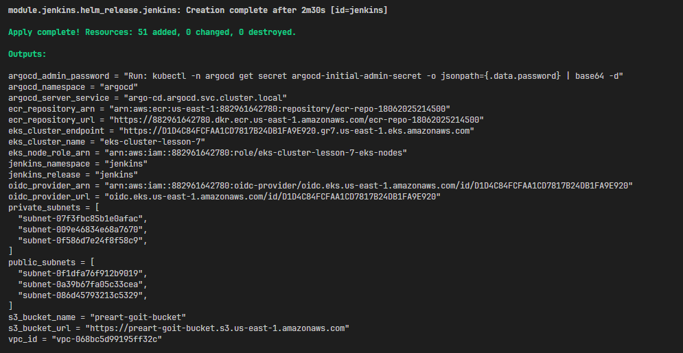
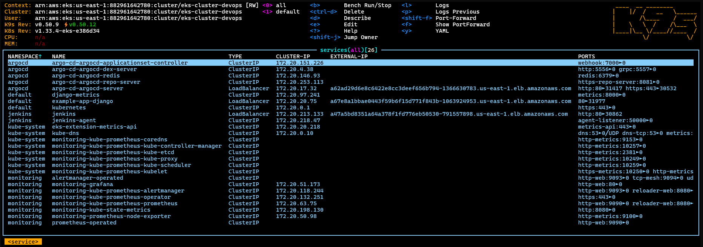
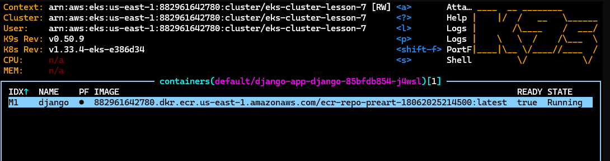
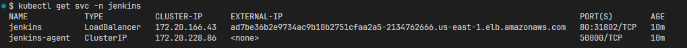
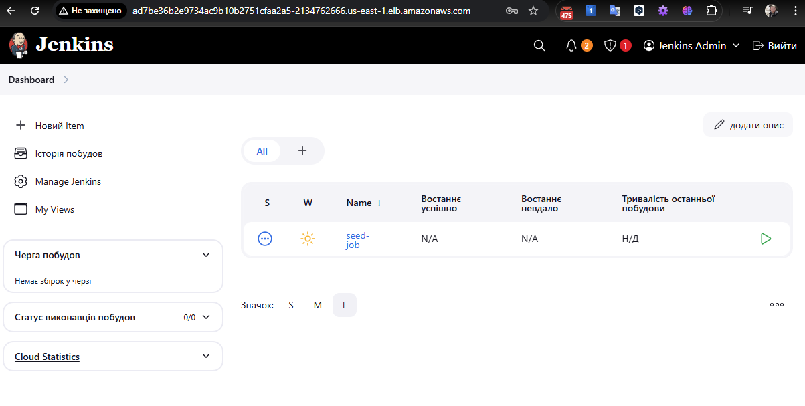
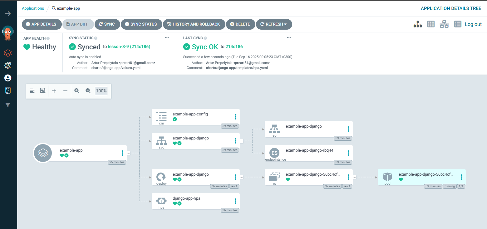

# IaC (Terraform)

Опис завдання

Завдання полягає у створенні Terraform-структури для інфраструктури на AWS.

Потрібно налаштувати:

1. Синхронізацію стейт-файлів у S3 з використанням DynamoDB для блокування.
2. Мережеву інфраструктуру (VPC) з публічними та приватними підмережами.
3. ECR (Elastic Container Registry) для зберігання Docker-образів.

Структура проекту

```sh
Progect/
│
├── main.tf                  # Головний файл для підключення модулів
├── backend.tf               # Налаштування бекенду для стейтів (S3 + DynamoDB
├── outputs.tf               # Загальні виводи ресурсів
│
├── modules/                 # Каталог з усіма модулями
│   ├── s3-backend/          # Модуль для S3 та DynamoDB
│   │   ├── s3.tf            # Створення S3-бакета
│   │   ├── dynamodb.tf      # Створення DynamoDB
│   │   ├── variables.tf     # Змінні для S3
│   │   └── outputs.tf       # Виведення інформації про S3 та DynamoDB
│   │
│   ├── vpc/                 # Модуль для VPC
│   │   ├── vpc.tf           # Створення VPC, підмереж, Internet Gateway
│   │   ├── routes.tf        # Налаштування маршрутизації
│   │   ├── variables.tf     # Змінні для VPC
│   │   └── outputs.tf
│   ├── ecr/                 # Модуль для ECR
│   │   ├── ecr.tf           # Створення ECR репозиторію
│   │   ├── variables.tf     # Змінні для ECR
│   │   └── outputs.tf       # Виведення URL репозиторію
│   │
│   ├── eks/                      # Модуль для Kubernetes кластера
│   │   ├── eks.tf                # Створення кластера
│   │   ├── aws_ebs_csi_driver.tf # Встановлення плагіну csi drive
│   │   ├── variables.tf          # Змінні для EKS
│   │   └── outputs.tf            # Виведення інформації про кластер
│   │
│   ├── rds/                 # Модуль для RDS
│   │   ├── rds.tf           # Створення RDS бази даних
│   │   ├── aurora.tf        # Створення aurora кластера бази даних
│   │   ├── shared.tf        # Спільні ресурси
│   │   ├── variables.tf     # Змінні (ресурси, креденшели, values)
│   │   └── outputs.tf
│   │
│   ├── jenkins/             # Модуль для Helm-установки Jenkins
│   │   ├── jenkins.tf       # Helm release для Jenkins
│   │   ├── variables.tf     # Змінні (ресурси, креденшели, values)
│   │   ├── providers.tf     # Оголошення провайдерів
│   │   ├── values.yaml      # Конфігурація jenkins
│   │   └── outputs.tf       # Виводи (URL, пароль адміністратора)
│   │
│   └── argo_cd/             # Модуль для Helm-установки Argo CD
│       ├── jenkins.tf       # Helm release для Jenkins
│       ├── variables.tf     # Змінні (версія чарта, namespace, repo URL тощо)
│       ├── providers.tf     # Kubernetes+Helm.  переносимо з модуля jenkins
│       ├── values.yaml      # Кастомна конфігурація Argo CD
│       └── outputs.tf       # Виводи (hostname, initial admin password)
│		    ├──charts/       # Helm-чарт для створення app'ів
│ 	 	    ├── Chart.yaml
│	  	    └── values.yaml          # Список applications, repositories
│			    ├── templates/
│		        ├── application.yaml
│		        └── repository.yaml
├── charts/                     # Каталог з helm-чартами
│   └── django-app/             # Чарт для застосунку на Django
│       ├── templates/          # Каталог з шаблонами manifest-файлів
│       │   ├── deployment.yaml # Шаблон для Kubernetes Deployment
│       │   ├── service.yaml    # Шаблон для Kubernetes Service
│       │   ├── configmap.yaml  # Шаблон для Kubernetes ConfigMap
│       │   └── hpa.yaml        # Шаблон для Kubernetes HorizontalPodAutoscaler
│       ├── Chart.yaml       # Метаінформація про чарт
│       └── values.yaml      # ConfigMap зі змінними середовища
│
└── README.md                # Документація проєкту

```

Команди для ініціалізації та запуску terraform:

```sh
# Ініціалізація робочого каталогу Terraform (створення файлу terraform.tfstate)
terraform init

# Огляд змін (планування) до інфраструктури
terraform plan

# Застосування змін до інфраструктури
terraform apply

# Застосування тільки окремих модулів
terraform apply -target=module.vpc -target=module.s3-backend -target=module.rds

# Видалення інфраструктури
terraform destroy
```

## Налаштування доступів

Для зручності заповнимо дані заповнюємо в [terraform.tfvars](terraform.tfvars) згідно шаблону:

```ini
# terraform.tfvars

# ---------------- github ----------------

# облікові дані для доступу до приватного репозиторію
github_user = "YOUR_USERNAME"

# токен доступу
github_pat = "ghp_token"

# повна URL-адреса Git-репозиторію https://github.com/YOUR_USERNAME/example-repo.git
github_repo_url = "https://github.com/YOUR_USERNAME/example-repo.git"
```

Файл додано в [.gitignore](.gitignore), тому він не включається в репозиторій.

## Перший запуск

Перед першим запуском може виникнути помилка збереження стейта, оскільки ще не створено DynamoDB та bucket. Для уникнення помилки потрібно виконати перший запуск наступним чином:

### Підготовка backend

1. S3-бакет з іменем, налаштованим у параметрі `bucket_name` [main.tf](main.tf) повинен бути створений
   ([Terraform / Configuration Language / Backend block /
   s3](https://developer.hashicorp.com/terraform/language/backend/s3))
2. Закоментуємо конфігурацію бекенда "s3" у файлі [backend.tf](backend.tf).
   Це змусить Terraform тимчасово використовувати локальний файл стану.
3. Потім запускаємо `terraform init` і `terraform apply`, щоб створити S3 bucket і таблицю DynamoDB в AWS.
4. Після того, як ресурси будуть створені, розкоментуємо конфігурацію бекенда "s3" у [backend.tf](backend.tf).
5. Нарешті, знову запускаємо `terraform init`. Terraform виявить існуючий локальний стан і попросить перенести його до новоствореного бекенду S3.

## Створення інфраструктури

```sh
# Ініціалізація робочого каталогу Terraform (створення файлу terraform.tfstate)
terraform init

# Огляд змін (планування) до інфраструктури
terraform plan

# Застосування змін до інфраструктури
terraform apply
```



## Перевірка

### Встановлення k9s

Якщо k9s ще не встановлено, ви можете зробити це одним із способів нижче.

- macOS (через Homebrew):

  ```Bash
  brew install k9s
  ```

  Linux (через Homebrew):

  ```Bash
  brew install k9s
  ```

- Windows (через Scoop або Chocolatey):

  ```Bash
  # Scoop
  scoop install k9s

  # Chocolatey
  choco install k9s
  ```

### Налаштування доступу до Kubernetes

K9s використовує той самий файл конфігурації, що й kubectl. Щоб перевірити, чи все налаштовано правильно, виконайте команду:

```Bash
kubectl config current-context
```

Якщо ця команда повертає назву вашого кластера, k9s зможе до нього підключитися.
Якщо повертає помилку - потрібно налаштувати EKS

```Bash
aws eks update-kubeconfig --name <назва_вашого_кластера> --region <регіон>
aws eks update-kubeconfig --name eks-cluster-devops --region us-east-1
```

### Перевірка інфраструктури за допомогою k9s

```bash
k9s
```



## Завантаження Docker-образу до ECR

Завантажимо Docker-образ Django, який створювали в гілці lesson-4, до ECR, використовуючи AWS CLI.

Отримаємо URL ECR репозиторію з Terraform state:

```sh
terraform output ecr_repository_url
"https://882961642780.dkr.ecr.us-east-1.amazonaws.com/ecr-repo-preart-18062025214500"
```

Визначимо змінну repository в [charts/django-app/values.yaml](charts/django-app/values.yaml)

```yaml
repository: "882961642780.dkr.ecr.us-east-1.amazonaws.com/ecr-repo-preart-18062025214500"
```

Завантажимо образ до AWS ECR

```sh
# Авторизація в ECR
aws ecr get-login-password --region us-east-1 | docker login --username AWS --password-stdin 882961642780.dkr.ecr.us-east-1.amazonaws.com

# Створення образу
# Перейдемо до папки django та створимо Docker-образ:
cd django && docker build -t django-app:latest -f dockerfile .

# Docker-образ успішно створено. Тепер тегуємо його для ECR репозиторію:
docker tag django-app:latest 882961642780.dkr.ecr.us-east-1.amazonaws.com/ecr-repo-preart-18062025214500:latest

# Завантажимо образ до ECR:
docker push 882961642780.dkr.ecr.us-east-1.amazonaws.com/ecr-repo-preart-18062025214500:latest
```

Перевіримо, що образ успішно завантажено до ECR:

```sh
aws ecr describe-images --repository-name ecr-repo-preart-18062025214500 --region us-east-1
{
    "imageDetails": [
        {
            "registryId": "882961642780",
            "repositoryName": "ecr-repo-preart-18062025214500",
            "imageDigest": "sha256:08268cd7399a050912f6b0ca0458159d4b3c75f6f4965a0522557477adbbd837",
            "imageSizeInBytes": 58059112,
            "imagePushedAt": "2025-09-14T15:34:47.727000+03:00",
            "imageManifestMediaType": "application/vnd.oci.image.manifest.v1+json",
            "artifactMediaType": "application/vnd.oci.image.config.v1+json"
        },
        {
            "registryId": "882961642780",
            "repositoryName": "ecr-repo-preart-18062025214500",
            "imageDigest": "sha256:523fceb2b619b1b99c31d47ed3e84f5d81369e0e057bbb08287e40bf2dd9ae9a",
            "imageSizeInBytes": 1356,
            "imagePushedAt": "2025-09-14T15:34:47.715000+03:00",
            "imageManifestMediaType": "application/vnd.oci.image.manifest.v1+json",
            "artifactMediaType": "application/vnd.oci.image.config.v1+json"
        },
        {
            "registryId": "882961642780",
            "repositoryName": "ecr-repo-preart-18062025214500",
            "imageDigest": "sha256:8075791de2266ee4836052622ab1cb791e1aa5ec0c8d9c24bc4b3be6b98e1211",
            "imageTags": [
                "latest"
            ],
            "imageSizeInBytes": 58059112,
            "imagePushedAt": "2025-09-14T15:34:48.275000+03:00",
            "imageManifestMediaType": "application/vnd.oci.image.index.v1+json"
        }
    ]
}
```

## Розгортання Django додатку через Helm

1. Встановлення Helm (якщо потрібно)

```sh
# Для Windows (через Chocolatey)
choco install kubernetes-helm
```

2. Розгортання через Helm

```sh
# Перейти в директорію з чартами
cd charts/django-app

# Встановити реліз
helm install django-app . --set ecr_repository_url=YOUR_ECR_URL

# Або з файлом values
helm install django-app . -f values.yaml
```

```sh
helm install django-app . -f values.yaml

NAME: django-app
LAST DEPLOYED: Sun Sep 14 16:27:03 2025
NAMESPACE: default
STATUS: deployed
REVISION: 1
TEST SUITE: None

#Перевірка чи встановлено додаток
kubectl get hpa -A
NAMESPACE   NAME             REFERENCE                          TARGETS              MINPODS   MAXPODS   REPLICAS   AGE
default     django-app-hpa   Deployment/django-app-deployment   cpu: <unknown>/70%   2         6         0          5m27s
```



## Перевірка створених ресурсів ArgoCD, Jenkins

```bash
# ArgoCD адреса сервера
kubectl get svc -n argocd

# ArgoCD логін admin, пароль:
kubectl -n argocd get secret argocd-initial-admin-secret -o jsonpath={.data.password} | base64 -d

# Jenkins admin:admin123 адреса сервера:
kubectl get svc -n jenkins
```




Вигляд інтерфейсу Jenkins з робочим pipeline, що збирає, пушить і оновлює Git:



Argo application із повною синхронізацією Helm chart



## Видалення інфраструктури

```bash
# Видалення інфраструктури
terraform destroy
```
