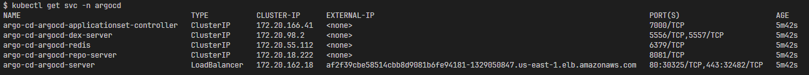
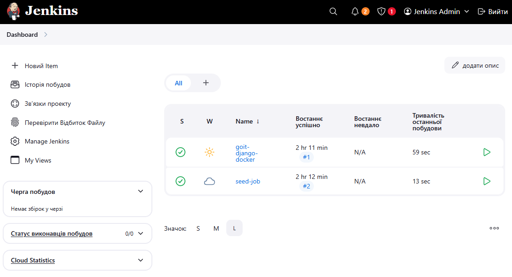
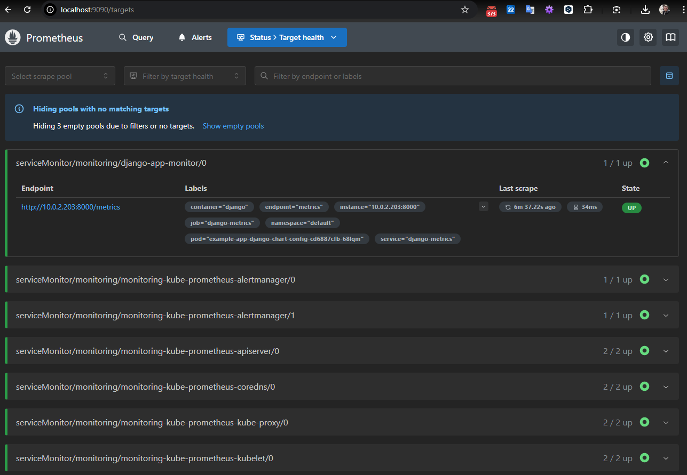

# Розгортання інфраструктури DevOps на AWS

Проєкт виконує збирання та розгортання повної інфраструктури DevOps на AWS з використанням Terraform, що включає наступні компоненти:

- Розгортання Kubernetes кластера (EKS) з підтримкою CI/CD
- Інтеграція Jenkins для автоматизації збірки та деплою
- Інсталяція Argo CD для управління застосунками
- Налаштування бази даних (RDS або Aurora)
- Організація контейнерного реєстру (ECR)
- Моніторинг з Prometheus та Grafana

Технічні характеристики:

- **Інфраструктура:** AWS з використанням Terraform
- **Компоненти:** VPC, EKS, RDS, ECR, Jenkins, Argo CD, Prometheus, Grafana

## Структура проєкту

```sh
Project/
│
├── main.tf                  # Головний файл для підключення модулів
├── backend.tf               # Налаштування бекенду для стейтів (S3 + DynamoDB
├── outputs.tf               # Загальні виводи ресурсів
│
├── modules/                 # Каталог з усіма модулями
│   ├── s3-backend/          # Модуль для S3 та DynamoDB
│   │   ├── s3.tf            # Створення S3-бакета
│   │   ├── dynamodb.tf      # Створення DynamoDB
│   │   ├── variables.tf     # Змінні для S3
│   │   └── outputs.tf       # Виведення інформації про S3 та DynamoDB
│   │
│   ├── vpc/                 # Модуль для VPC
│   │   ├── vpc.tf           # Створення VPC, підмереж, Internet Gateway
│   │   ├── routes.tf        # Налаштування маршрутизації
│   │   ├── variables.tf     # Змінні для VPC
│   │   └── outputs.tf
│   ├── ecr/                 # Модуль для ECR
│   │   ├── ecr.tf           # Створення ECR репозиторію
│   │   ├── variables.tf     # Змінні для ECR
│   │   └── outputs.tf       # Виведення URL репозиторію
│   │
│   ├── eks/                      # Модуль для Kubernetes кластера
│   │   ├── eks.tf                # Створення кластера
│   │   ├── aws_ebs_csi_driver.tf # Встановлення плагіну csi drive
│   │   ├── variables.tf          # Змінні для EKS
│   │   └── outputs.tf            # Виведення інформації про кластер
│   │
│   ├── rds/                 # Модуль для RDS
│   │   ├── rds.tf           # Створення RDS бази даних
│   │   ├── aurora.tf        # Створення aurora кластера бази даних
│   │   ├── shared.tf        # Спільні ресурси
│   │   ├── variables.tf     # Змінні (ресурси, креденшели, values)
│   │   └── outputs.tf
│   │
│   ├── jenkins/             # Модуль для Helm-установки Jenkins
│   │   ├── jenkins.tf       # Helm release для Jenkins
│   │   ├── variables.tf     # Змінні (ресурси, креденшели, values)
│   │   ├── providers.tf     # Оголошення провайдерів
│   │   ├── values.yaml      # Конфігурація jenkins
│   │   └── outputs.tf       # Виводи (URL, пароль адміністратора)
│   │
│   └── argo_cd/             # Модуль для Helm-установки Argo CD
│       ├── jenkins.tf       # Helm release для Jenkins
│       ├── variables.tf     # Змінні (версія чарта, namespace, repo URL тощо)
│       ├── providers.tf     # Kubernetes+Helm.  переносимо з модуля jenkins
│       ├── values.yaml      # Кастомна конфігурація Argo CD
│       └── outputs.tf       # Виводи (hostname, initial admin password)
│		    ├──charts/       # Helm-чарт для створення app'ів
│ 	 	    ├── Chart.yaml
│	  	    └── values.yaml          # Список applications, repositories
│			    ├── templates/
│		        ├── application.yaml
│		        └── repository.yaml
├── charts/                     # Каталог з helm-чартами
│   └── django-app/             # Чарт для застосунку на Django
│       ├── templates/          # Каталог з шаблонами manifest-файлів
│       │   ├── deployment.yaml # Шаблон для Kubernetes Deployment
│       │   ├── service.yaml    # Шаблон для Kubernetes Service
│       │   ├── configmap.yaml  # Шаблон для Kubernetes ConfigMap
│       │   └── hpa.yaml        # Шаблон для Kubernetes HorizontalPodAutoscaler
│       ├── Chart.yaml       # Метаінформація про чарт
│       └── values.yaml      # ConfigMap зі змінними середовища
│
└── README.md                # Документація проєкту

```

## Налаштування Terraform

Потрібно налаштувати:

1. Синхронізацію стейт-файлів у S3 з використанням DynamoDB для блокування.
2. Мережеву інфраструктуру (VPC) з публічними та приватними підмережами.
3. ECR (Elastic Container Registry) для зберігання Docker-образів.

### Налаштування доступів

Для зручності заповнимо дані заповнюємо в [terraform.tfvars](terraform.tfvars) згідно шаблону:

```ini
# terraform.tfvars

# ---------------- github ----------------

# облікові дані для доступу до приватного репозиторію
github_user = "YOUR_USERNAME"

# токен доступу
github_pat = "ghp_token"

# повна URL-адреса Git-репозиторію https://github.com/YOUR_USERNAME/example-repo.git
github_repo_url = "https://github.com/YOUR_USERNAME/example-repo.git"

# гілка з кодом застосунку
github_branch = "main"

# ---------------- RDS ----------------
# rds_cluster_name = "rds-cluster"
use_aurora = false
db_name = "django_db"
username = "DJANGO_APP_DB_USERNAME"
password = "DJANGO_APP_DB_PASS"

```

Файл додано в [.gitignore](.gitignore), тому він не включається в репозиторій.

### Перший запуск. Підготовка backend

Перед першим запуском може виникнути помилка збереження стейта, оскільки ще не створено DynamoDB та bucket. Для уникнення помилки потрібно виконати перший запуск наступним чином:

1. S3-бакет з іменем, налаштованим у параметрі `bucket_name` [main.tf](main.tf) повинен бути створений
   ([Terraform / Configuration Language / Backend block /
   s3](https://developer.hashicorp.com/terraform/language/backend/s3))
2. Закоментуємо конфігурацію бекенда "s3" у файлі [backend.tf](backend.tf).
   Це змусить Terraform тимчасово використовувати локальний файл стану.
3. Потім запускаємо `terraform init` і `terraform apply`, щоб створити S3 bucket і таблицю DynamoDB в AWS.
4. Після того, як ресурси будуть створені, розкоментуємо конфігурацію бекенда "s3" у [backend.tf](backend.tf).
5. Нарешті, знову запускаємо `terraform init`. Terraform виявить існуючий локальний стан і попросить перенести його до новоствореного бекенду S3.

## Створення інфраструктури з використанням Terraform

**Команди для ініціалізації та запуску terraform:**

```sh
# Ініціалізація робочого каталогу Terraform (створення файлу terraform.tfstate)
terraform init

# Огляд змін (планування) до інфраструктури
terraform plan

# Застосування змін до інфраструктури
terraform apply

# Застосування змін до інфраструктури без підтвердження
terraform apply -auto-approve

# Застосування тільки окремих модулів
terraform apply -target=module.vpc -target=module.s3-backend -target=module.rds

# Видалення інфраструктури
terraform destroy

# Видалення інфраструктури без підтвердження
terraform destroy -auto-approve
```


## Перевірка

### Встановлення k9s

Якщо k9s ще не встановлено, ви можете зробити це одним із способів нижче.

- macOS (через Homebrew):

  ```sh
  brew install k9s
  ```

  Linux (через Homebrew):

  ```sh
  brew install k9s
  ```

- Windows (через Scoop або Chocolatey):

  ```sh
  # Scoop
  scoop install k9s

  # Chocolatey
  choco install k9s
  ```

### Налаштування доступу k9s до Kubernetes

K9s використовує той самий файл конфігурації, що й kubectl. Щоб перевірити, чи все налаштовано правильно, виконайте команду:

```sh
kubectl config current-context
```

Якщо ця команда повертає назву вашого кластера, k9s зможе до нього підключитися.
Якщо повертає помилку - потрібно налаштувати EKS

```sh
aws eks update-kubeconfig --name <назва_вашого_кластера> --region <регіон>
aws eks update-kubeconfig --name eks-cluster-devops --region us-east-1
```

### Перевірка інфраструктури

Перевіримо сервіси за допомогою k9s

```sh
k9s
```


Перевіримо стан ресурсів через `kubectl`

<details>
<summary>kubectl get all -n jenkins</summary>

```sh
kubectl get all -n jenkins
NAME            READY   STATUS    RESTARTS   AGE
pod/jenkins-0   2/2     Running   0          3h17m

NAME                    TYPE           CLUSTER-IP       EXTERNAL-IP                                                              PORT(S)        AGE
service/jenkins         LoadBalancer   172.20.213.133   a47a5bd8351a64a378f1fd776eb50530-791557898.us-east-1.elb.amazonaws.com   80:30862/TCP   3h17m
service/jenkins-agent   ClusterIP      172.20.218.47    <none>                                                                   50000/TCP      3h17m

NAME                       READY   AGE
statefulset.apps/jenkins   1/1     3h17m
```

</details>

<details>  
<summary>kubectl get all -n argocd</summary>

```sh
kubectl get all -n argocd
NAME                                                           READY   STATUS    RESTARTS   AGE
pod/argo-cd-argocd-application-controller-0                    1/1     Running   0          70m
pod/argo-cd-argocd-applicationset-controller-6b568b5cc-62xkb   1/1     Running   0          70m
pod/argo-cd-argocd-dex-server-6d9f4b9b76-ntxgf                 1/1     Running   0          70m
pod/argo-cd-argocd-notifications-controller-78dcd4cb9-p6jzc    1/1     Running   0          70m
pod/argo-cd-argocd-redis-8848d97fb-dtfs8                       1/1     Running   0          70m
pod/argo-cd-argocd-repo-server-6fd8f76b4d-t9q9j                1/1     Running   0          70m
pod/argo-cd-argocd-server-ffc875c8b-vp9ks                      1/1     Running   0          70m

NAME                                               TYPE           CLUSTER-IP       EXTERNAL-IP                                                               PORT(S)                      AGE
service/argo-cd-argocd-applicationset-controller   ClusterIP      172.20.151.226   <none>                                                                    7000/TCP                     70m
service/argo-cd-argocd-repo-server                 ClusterIP      172.20.253.113   <none>                                                                    8081/TCP                     70m
service/argo-cd-argocd-server                      LoadBalancer   172.20.17.32     a62ad29d6e8c6422e8cc3deef656b794-1366630783.us-east-1.elb.amazonaws.com   80:31417/TCP,443:30532/TCP   70m

NAME                                                       READY   UP-TO-DATE   AVAILABLE   AGE
deployment.apps/argo-cd-argocd-applicationset-controller   1/1     1            1           70m
deployment.apps/argo-cd-argocd-dex-server                  1/1     1            1           70m
deployment.apps/argo-cd-argocd-notifications-controller    1/1     1            1           70m
deployment.apps/argo-cd-argocd-redis                       1/1     1            1           70m
deployment.apps/argo-cd-argocd-repo-server                 1/1     1            1           70m
deployment.apps/argo-cd-argocd-server                      1/1     1            1           70m

NAME                                                                 DESIRED   CURRENT   READY   AGE
replicaset.apps/argo-cd-argocd-applicationset-controller-6b568b5cc   1         1         1       70m
replicaset.apps/argo-cd-argocd-dex-server-6d9f4b9b76                 1         1         1       70m
replicaset.apps/argo-cd-argocd-notifications-controller-78dcd4cb9    1         1         1       70m
replicaset.apps/argo-cd-argocd-redis-8848d97fb                       1         1         1       70m
replicaset.apps/argo-cd-argocd-repo-server-6fd8f76b4d                1         1         1       70m
replicaset.apps/argo-cd-argocd-server-ffc875c8b                      1         1         1       70m

NAME                                                     READY   AGE
statefulset.apps/argo-cd-argocd-application-controller   1/1     70m
```

</details>

<details>
<summary>kubectl get all -n monitoring</summary>

```sh
kubectl get all -n monitoring
NAME                                                         READY   STATUS    RESTARTS   AGE
pod/alertmanager-monitoring-kube-prometheus-alertmanager-0   2/2     Running   0          23m
pod/monitoring-grafana-577868b7c8-f5fdx                      3/3     Running   0          23m
pod/monitoring-kube-prometheus-operator-79c79654f-2q4v6      1/1     Running   0          23m
pod/monitoring-kube-state-metrics-7fc7c7469d-6k956           1/1     Running   0          23m
pod/monitoring-prometheus-node-exporter-qcq6d                1/1     Running   0          23m
pod/monitoring-prometheus-node-exporter-wq6kz                1/1     Running   0          23m
pod/prometheus-monitoring-kube-prometheus-prometheus-0       2/2     Running   0          23m

NAME                                              TYPE        CLUSTER-IP       EXTERNAL-IP   PORT(S)                      AGE
service/alertmanager-operated                     ClusterIP   None             <none>        9093/TCP,9094/TCP,9094/UDP   23m
service/monitoring-grafana                        ClusterIP   172.20.51.173    <none>        80/TCP                       23m
service/monitoring-kube-prometheus-alertmanager   ClusterIP   172.20.118.244   <none>        9093/TCP,8080/TCP            23m
service/monitoring-kube-prometheus-operator       ClusterIP   172.20.132.251   <none>        443/TCP                      23m
service/monitoring-kube-prometheus-prometheus     ClusterIP   172.20.63.75     <none>        9090/TCP,8080/TCP            23m
service/monitoring-kube-state-metrics             ClusterIP   172.20.198.130   <none>        8080/TCP                     23m
service/monitoring-prometheus-node-exporter       ClusterIP   172.20.50.98     <none>        9100/TCP                     23m
service/prometheus-operated                       ClusterIP   None             <none>        9090/TCP                     23m

NAME                                                 DESIRED   CURRENT   READY   UP-TO-DATE   AVAILABLE   NODE SELECTOR            AGE
daemonset.apps/monitoring-prometheus-node-exporter   2         2         2       2            2           kubernetes.io/os=linux   23m

NAME                                                  READY   UP-TO-DATE   AVAILABLE   AGE
deployment.apps/monitoring-grafana                    1/1     1            1           23m
deployment.apps/monitoring-kube-prometheus-operator   1/1     1            1           23m
deployment.apps/monitoring-kube-state-metrics         1/1     1            1           23m

NAME                                                            DESIRED   CURRENT   READY   AGE
replicaset.apps/monitoring-grafana-577868b7c8                   1         1         1       23m
replicaset.apps/monitoring-kube-prometheus-operator-79c79654f   1         1         1       23m
replicaset.apps/monitoring-kube-state-metrics-7fc7c7469d        1         1         1       23m

NAME                                                                    READY   AGE
statefulset.apps/alertmanager-monitoring-kube-prometheus-alertmanager   1/1     23m
statefulset.apps/prometheus-monitoring-kube-prometheus-prometheus       1/1     23m

```

</details>

## Ручне розгортання сервісів

<details>
  <summary>Цей розділ для довідки, виконувати його інструкції не потрібно - всі сервіси в кінцевому варіанті проєкту розгортаються автоматично</summary>

### Завантаження Docker-образу до ECR

Завантажимо Docker-образ Django, який створювали в гілці lesson-4, до ECR, використовуючи AWS CLI.

Отримаємо URL ECR репозиторію з Terraform state:

```sh
terraform output ecr_repository_url
"https://882961642780.dkr.ecr.us-east-1.amazonaws.com/ecr-repo-preart-18062025214500"
```

Визначимо змінну repository в [charts/django-app/values.yaml](charts/django-app/values.yaml)

```yaml
repository: "882961642780.dkr.ecr.us-east-1.amazonaws.com/ecr-repo-preart-18062025214500"
```

Завантажимо образ до AWS ECR

```sh
# Авторизація в ECR
aws ecr get-login-password --region us-east-1 | docker login --username AWS --password-stdin 882961642780.dkr.ecr.us-east-1.amazonaws.com

# Створення образу
# Перейдемо до папки django та створимо Docker-образ:
cd django && docker build -t django-app:latest -f dockerfile .

# Docker-образ успішно створено. Тепер тегуємо його для ECR репозиторію:
docker tag django-app:latest 882961642780.dkr.ecr.us-east-1.amazonaws.com/ecr-repo-preart-18062025214500:latest

# Завантажимо образ до ECR:
docker push 882961642780.dkr.ecr.us-east-1.amazonaws.com/ecr-repo-preart-18062025214500:latest
```

Перевіримо, що образ успішно завантажено до ECR:

```sh
aws ecr describe-images --repository-name ecr-repo-preart-18062025214500 --region us-east-1
{
    "imageDetails": [
        {
            "registryId": "882961642780",
            "repositoryName": "ecr-repo-preart-18062025214500",
            "imageDigest": "sha256:08268cd7399a050912f6b0ca0458159d4b3c75f6f4965a0522557477adbbd837",
            "imageSizeInBytes": 58059112,
            "imagePushedAt": "2025-09-14T15:34:47.727000+03:00",
            "imageManifestMediaType": "application/vnd.oci.image.manifest.v1+json",
            "artifactMediaType": "application/vnd.oci.image.config.v1+json"
        },
        {
            "registryId": "882961642780",
            "repositoryName": "ecr-repo-preart-18062025214500",
            "imageDigest": "sha256:523fceb2b619b1b99c31d47ed3e84f5d81369e0e057bbb08287e40bf2dd9ae9a",
            "imageSizeInBytes": 1356,
            "imagePushedAt": "2025-09-14T15:34:47.715000+03:00",
            "imageManifestMediaType": "application/vnd.oci.image.manifest.v1+json",
            "artifactMediaType": "application/vnd.oci.image.config.v1+json"
        },
        {
            "registryId": "882961642780",
            "repositoryName": "ecr-repo-preart-18062025214500",
            "imageDigest": "sha256:8075791de2266ee4836052622ab1cb791e1aa5ec0c8d9c24bc4b3be6b98e1211",
            "imageTags": [
                "latest"
            ],
            "imageSizeInBytes": 58059112,
            "imagePushedAt": "2025-09-14T15:34:48.275000+03:00",
            "imageManifestMediaType": "application/vnd.oci.image.index.v1+json"
        }
    ]
}
```

### Розгортання Django додатку через Helm

1. Встановлення Helm (якщо потрібно)

```sh
# Для Windows (через Chocolatey)
choco install kubernetes-helm
```

2. Розгортання через Helm

```sh
# Перейти в директорію з чартами
cd charts/django-app

# Встановити реліз
helm install django-app . --set ecr_repository_url=YOUR_ECR_URL

# Або з файлом values
helm install django-app . -f values.yaml
```

```sh
helm install django-app . -f values.yaml

NAME: django-app
LAST DEPLOYED: Sun Sep 14 16:27:03 2025
NAMESPACE: default
STATUS: deployed
REVISION: 1
TEST SUITE: None

#Перевірка чи встановлено додаток
kubectl get hpa -A
NAMESPACE   NAME             REFERENCE                          TARGETS              MINPODS   MAXPODS   REPLICAS   AGE
default     django-app-hpa   Deployment/django-app-deployment   cpu: <unknown>/70%   2         6         0          5m27s
```


</details>

## Перевірка створених ресурсів ArgoCD, Jenkins

**Для роботи з сервісами ArgoCD, Jenkins отримаємо їх адреси та початкові налаштування:**

```sh
# ArgoCD адреса сервера
kubectl get svc -n argocd

# ArgoCD логін admin, пароль:
kubectl -n argocd get secret argocd-initial-admin-secret -o jsonpath={.data.password} | base64 -d

# Jenkins admin:admin123 адреса сервера:
kubectl get svc -n jenkins
```




<details>
  <summary>Вигляд інтерфейсу Jenkins з робочим pipeline, що збирає, пушить і оновлює Git:</summary>



</details>

<details>
  <summary>Argo application із повною синхронізацією Helm chart</summary>


</details>

## Створення гнучкого Terraform-модуля для баз даних

<details> 
<summary>Функціонал модуля:</summary>
Модуль гнучко підтримує обидва сценарії: достатньо змінити значення параметра use_aurora, щоб переключитись між класичним RDS-інстансом і масштабованим Aurora-кластером із репліками.

Такий підхід дозволяє DevOps-інженеру швидко адаптувати інфраструктуру під вимоги продуктивності, надійності або бюджету без дублювання коду.

- Налаштування типу RDS за допомогою змінної `use_aurora`

  ```hcl
  # main.tf
  module "rds" {
    ...
    use_aurora              = var.use_aurora
    ...
  }

  # variables.tf
  variable "use_aurora" {
    description = "Чи використовувати Aurora (true) або стандартний RDS (false)"
    type        = bool
    default     = false
  }
  ```

  - `use_aurora = true` → створюється Aurora Cluster + writer;
  - `use_aurora = false` → створюється одна `aws_db_instance`;

- В обох випадках:
  - створюється `aws_db_subnet_group`;
  - створюється `aws_security_group`;
  - створюється `parameter group` з базовими параметрами (`max_connections`, `log_statement`, `work_mem`);
- Параметри `engine`, `engine_version`, `instance_class`, `multi_az` задаються через змінні.
</details>

<details>
  <summary>Опис усіх змінних</summary>

**main.tf Основні параметри для створення БД**

- `rds_cluster_name` — назва інстансу (або кластера, якщо Aurora);
- `engine` — тип БД: `postgres`, `mysql`, `aurora`, `aurora-mysql`, `aurora-postgresql`;
- `engine_version` — версія БД;
- `instance_class` — клас EC2-подібного інстансу (`db.t3.medium`, `db.t3.micro`);
- `allocated_storage` — обсяг у ГБ, якщо це звичайна RDS.
- Aurora-only
  - `engine_cluster` — тип бази даних, яку буде запускати Aurora. У нашому випадку це `aurora-postgresql`, тобто Aurora із сумісністю з PostgreSQL. Можна також використати `aurora-mysql`, якщо потрібно створити кластер на базі MySQL.
  - `engine_version_cluster` — конкретна версія бази даних, яку запускатиме Aurora-кластер. Наприклад, `"15.3"` означає, що буде розгорнута Aurora PostgreSQL, сумісна з PostgreSQL 15.3. Важливо використовувати **лише ті версії, які офіційно підтримуються Aurora** (вони відстають від оригінальних релізів PostgreSQL).
  - `parameter_group_family_aurora` — «родина» параметрів для Aurora. Вона має точно відповідати вибраній версії engine. Наприклад, для `aurora-postgresql` із версією `15.3` потрібно вказати `aurora-postgresql15`. Це визначає набір доступних параметрів, які можна налаштувати в `parameter group`.

**Безпека та мережа**

- `subnet_public_ids` — список публічних сабнетів (через модуль vpc);
- `vpc_id` — вибір мережі (через модуль vpc);
- `publicly_accessible` — `false` означає, що БД доступна лише з приватної мережі;
- `multi_az` — створення резервної репліки в іншій AZ для відмовостійкості.

**Parameter Group**

- `parameter_group_family` — група параметрів, що сумісна з engine / version;
- `parameters` — словник довільних параметрів, які підуть у `parameter_group`.

**Файл: rds.tf**

- `aws_db_instance.standard` — створює **звичайний інстанс Amazon RDS**, наприклад для PostgreSQL або MySQL.  
  Цей інстанс не є частиною Aurora-кластера.

  - `identifier` — унікальне ім’я інстансу БД в AWS. Воно буде використане в DNS-імені БД.
  - `engine` — тип бази даних, наприклад `postgres`, `mysql`, `mariadb`, `oracle-se2` тощо.
  - `engine_version` — конкретна версія бази даних, яку потрібно встановити (наприклад, `"17.2"` для PostgreSQL).
  - `instance_class` — тип EC2-подібного інстансу, на якому працює БД (наприклад, `db.t3.medium`).
  - `allocated_storage` — обсяг дискового простору в ГБ, який буде виділено під БД. Обов’язковий для звичайної RDS.
  - `db_name` — ім’я бази даних, яка буде створена за замовчуванням.
  - `username` / `password` — облікові дані адміністративного користувача БД.
  - `db_subnet_group_name` — назва subnet group, у якій буде запущений інстанс (має містити приватні або публічні сабнети з VPC).
  - `vpc_security_group_ids` — список Security Group, які будуть застосовані до інстансу БД.
  - `multi_az` — логічне значення, яке вмикає Multi-AZ деплоймент для підвищеної відмовостійкості (створення standby-репліки в іншій AZ).
  - `publicly_accessible` — визначає, чи буде БД доступна з інтернету (`true` для публічного доступу, `false` — тільки в межах VPC).
  - `backup_retention_period` — кількість днів для збереження автоматичних резервних копій (0 — вимкнено).
  - `parameter_group_name` — назва параметр-групи (`aws_db_parameter_group`), яка задає специфічні конфігурації для движка БД (наприклад, `max_connections`, `log_min_duration_statement`).

- `aws_db_parameter_group.standard`:
  - `name` — унікальна назва для параметр-групи.
  - `family` — тип параметр-групи, який має **відповідати версії бази** (`postgres17` для PostgreSQL 17.х, `mysql8.0` для MySQL 8.0 тощо).
  - `parameter` — задає список параметрів конфігурації для БД, наприклад:
  - `max_connections = "200"`
  - `log_min_duration_statement = "500"`
  - `apply_method = "pending-reboot"` — визначає, коли зміни параметрів будуть застосовані. `pending-reboot` означає, що інстанс буде потрібно перезапустити вручну для застосування.

**shared.tf — спільні ресурси для Aurora та звичайного RDS**

- `aws_db_subnet_group.default` — створює **групу сабнетів**, у якій буде розміщено RDS або Aurora.
- Потрібно вказати список `subnet_ids`, у яких Amazon буде запускати інстанси бази.
- `subnet_ids = var.publicly_accessible ? var.subnet_public_ids : var.subnet_private_ids`
- Логіка перемикає сабнети залежно від того, чи має бути БД доступна з інтернету:
- `publicly_accessible = true` → використовуються публічні сабнети;
- `false` → приватні.
- `name` — ім’я subnet group, формується на основі назви БД.
- `aws_security_group.rds` — створює **Security Group**, яка дозволяє доступ до бази даних.
- `from_port` / `to_port = 5432` — відкриває порт PostgreSQL (або інший, якщо треба).
- `cidr_blocks = ["0.0.0.0/0"]` — тимчасово відкриває доступ з будь-якої IP-адреси (⚠️ слід обмежити у production).
- `vpc_id = var.vpc_id` — підключає SG до потрібної VPC.

**Файл: aurora.tf**  
Файл Terraform-сценарію. Тут описана Amazon Aurora, яку ми підіймаємо в AWS.

- `aws_rds_cluster "aurora"`  
  Створює сам кластер Amazon Aurora, у якому зберігається основна логіка та конфігурація БД. Це «серце» Aurora, яке обʼєднує всі інстанси (writer / reader).

  - `count = var.use_aurora ? 1 : 0` — дозволяє створювати кластер, тільки якщо увімкнено `use_aurora = true`.
  - `engine` / `engine_version` — тип (`aurora-postgresql`) і версія БД, наприклад `15.3`.
  - `master_username` / `master_password` — облікові дані адміністратора бази.
  - `db_subnet_group_name` — група сабнетів, у яких буде розміщено всі інстанси.
  - `vpc_security_group_ids` — дозволи доступу (SG).
  - `backup_retention_period` — кількість днів, протягом яких Aurora буде зберігати автоматичні бекапи.
  - `skip_final_snapshot = false` — зберігаємо snapshot перед видаленням.
  - `final_snapshot_identifier` — ім’я snapshot’а, який буде створено перед видаленням кластера.
  - `db_cluster_parameter_group_name` — посилання на параметр-групу Aurora.

- `aws_rds_cluster_instance "aurora_writer"`  
   Створює первинний інстанс Aurora, який виконує роль writer — він приймає всі записи в БД.

  - `identifier` — унікальна назва інстансу (наприклад, `myapp-db-writer`).
  - `cluster_identifier` — привʼязка до кластера, створеного вище.
  - `instance_class` — тип EC2-ресурсу, наприклад `db.r6g.large`, `db.t3.medium`.
  - `engine` — повинен збігатися з кластером (`aurora-postgresql`).
  - `publicly_accessible` — визначає, чи інстанс доступний з інтернету.

- `aws_rds_cluster_instance "aurora_readers"`  
   Додає репліки Aurora, які автоматично синхронізуються із writer-інстансом і приймають лише read-запити.

  - `count = var.aurora_replica_count` — кількість read-only реплік задається окремо (наприклад, 1-3).
  - `identifier` — формує унікальну назву для кожної репліки (`myapp-db-reader-0`, `1`…).
  - `cluster_identifier`, `instance_class`, `engine`, `publicly_accessible` — ті самі принципи, що і для writer.

- `aws_rds_cluster_parameter_group "aurora"`  
   Налаштовує параметри PostgreSQL, які будуть застосовані до всього кластера Aurora.

  - `family` — тип параметр-групи (наприклад, `aurora-postgresql15`), повинен відповідати `engine_version`.
  - `dynamic "parameter"` — дозволяє передавати будь-які параметри як `map`, наприклад:
    ```hcl
    parameters = {
      max_connections = "200"
      log_min_duration_statement = "500"
    }
    ```
  - `apply_method = "pending-reboot"` — параметри будуть застосовані після перезапуску кластера.

</details>

<details>
<summary>Скрин створеної бази даних</summary>


</details>

## Підготовка додатку

Для перевірки роботи додатку, потрібно його ініціалізувати

```sh
# застосовуємо міграції БД
python manage.py migrate
# створюємо користувача
python manage.py createsuperuser
```

<details>
<summary>Скриншоти працюючого додатку</summary>


</details>

## Моніторинг та перевірка метрик

Моніторинг реалізовано за допомогою

- Prometheus — система збору та зберігання метрик;
- Grafana — платформа візуалізації, яка перетворює дані на зрозумілі графіки й дашборди.

```sh
# Додати репозиторій Prometheus Community
helm repo add prometheus-community https://prometheus-community.github.io/helm-charts
helm repo update

# Встановити kube-prometheus-stack (включає Prometheus Operator)
helm install monitoring prometheus-community/kube-prometheus-stack \
  --namespace monitoring \
  --create-namespace

kubectl apply -f manifest

```

<details>
<summary>Секрети для доступу подивимось в k9s</summary>

Secrets > Describe > Toggle Decode


</details>
<details>

<summary>Налаштовуємо port-forward через k9s або kubectl</summary>

```sh
# Prometheus
kubectl port-forward -n monitoring svc/prometheus-server 9090:80
# Grafana
kubectl port-forward svc/grafana 3000:80 -n monitoring

```

</details>

<details>
<summary>Перевіряємо статус targets в Prometheus</summary>

Перейдемо на вкладку Target health:

- Показує **всі endpoints (таргети)**, які Prometheus намагається опитувати;
- Для кожного видно:
- `UP` або `DOWN`;
- адресу;
- останній час успішного scrape;
- HTTP-код і помилки.



</details>

<details>
<summary>Перевіряємо стан метрик в Grafana Dashboard</summary>


</details>

## Видалення інфраструктури

```sh
# Видалення інфраструктури
terraform destroy -auto-approve
```

<style>
pre, code {
    white-space: pre !important;
    overflow-x: auto !important;
    word-wrap: normal !important;
    word-break: normal !important;
}
</style>
